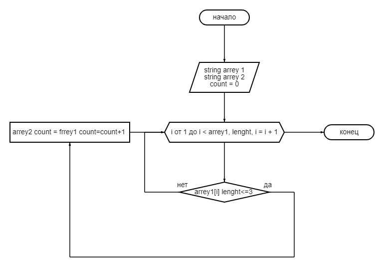

Сначала создаем два массива: первый задается и второй заполнит программа такой же длины. 

С помощью метода, в котором циклом  проверяем условие ( <=3 ), если да элемент первого массива заносится в  ячейку второго массива. 

После присвоения переменная count увеличивается   на 1 и возвращается к циклу for в котором i увеличивается на 1. 

И так проверяется до конца первого массива.

